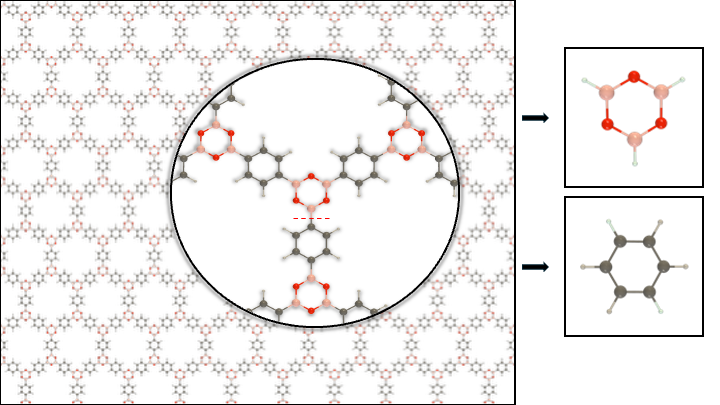

<p align="center">
  
</p>

<h1 align="center">COF-Landscaper</h1>

<p align="center">
  Automated structure generation, stacking-landscape screening, and PXRD simulation for two-dimensional covalent organic frameworks.
</p>

---

COF-Landscaper is a Python package for building and analysing 2D covalent organic frameworks (COFs). It provides workflows for generating COF structures from molecular building blocks, exploring stacking configurations, and comparing simulated PXRD patterns with experimental data.

Researchers interested in applying COF-Landscaper to their own systems are welcome to contact me at [gjl342@student.bham.ac.uk](mailto:gjl342@student.bham.ac.uk). Depending on availability and project scope, I may be able to provide support, discuss collaboration, or offer a short one- to two-day online introduction for users with limited software or terminal experience. This can cover installation, setup, input preparation, and running the workflow on example or user-provided systems.

## Installation

COF-Landscaper requires Python 3.12.

### Standard setup

The recommended setup is to use a dedicated Conda environment. If you do not already have Conda installed, a lightweight option is [Miniforge](https://conda-forge.org/download/).

Create and activate a new environment:

```bash
conda create -n coflandscaper python=3.12
conda activate coflandscaper
```

Upgrade `pip`:

```bash
python -m pip install --upgrade pip
```

Install COF-Landscaper from PyPI:

```bash
python -m pip install cof-landscaper
```

Check that the installation works:

```bash
python -c "import coflandscaper as cl; print(cl.__version__)"
```

### Alternative: existing Python 3.12 installation

If Python 3.12 is already available on your system, you can also use a standard virtual environment.

Check whether Python 3.12 is available:

```bash
python3.12 --version
```

If this command returns a Python 3.12 version, continue with the virtual environment setup (otherwise Python 3.12 can be installed from the [official Python downloads page](https://www.python.org/downloads/) or through a platform-specific package manager).

Create a virtual environment.

```bash
python3.12 -m venv coflandscaper
```

Activate the virtual environment on macOS or Linux:

```bash
source coflandscaper/bin/activate
```

On Windows PowerShell, use:

```powershell
.\coflandscaper\Scripts\Activate.ps1
```

Then install COF-Landscaper:

```bash
python -m pip install --upgrade pip
python -m pip install cof-landscaper
```

## Example Files

After installation, COF-Landscaper can be imported and used directly in your own Python scripts or notebooks.

If you want to start from the provided example workflows, run:

```bash
cof-landscaper-copy-examples
```

This copies the example files into the current directory under:

```text
examples/
```

The copied examples include an executable Python workflow under:

```text
examples/python/
```

This folder contains the workflow script and a separate `cof-landscaper.params.json` file where the workflow settings can be configured. It also includes a minimal notebook for plotting simulated PXRD data together with experimental PXRD data after the workflow has finished.

The copied examples also include three notebook versions under:

```text
examples/notebook/
```

The notebook versions are:

- `cof-landscaper_configurable.ipynb`: full notebook with Markdown explanations for all configurable options.
- `cof-landscaper_default.ipynb`: default workflow notebook with explanations for the default settings.
- `cof-landscaper_minimal.ipynb`: minimal code-only workflow for running the notebook without extended explanations.

You can then edit the copied Python script, JSON parameter file, notebook, and input `.xyz` files for your own system.

## Running the Notebooks

Install Jupyter support if you want to run the notebooks.

```bash
pip install jupyter ipykernel
```

Register the environment as a Jupyter kernel.

```bash
python -m ipykernel install --user --name coflandscaper --display-name "Python (coflandscaper)"
```

In VS Code or Jupyter, select the kernel:

```text
Python (coflandscaper)
```

Run a test cell:

```python
import coflandscaper as cl
```

## Developer Setup

For development, install [`just`](https://github.com/casey/just) and [`uv`](https://docs.astral.sh/uv/getting-started/installation/).

Clone the repository and enter the source directory.

```bash
git clone https://github.com/GregorLauter/COF-Landscaper.git
cd COF-Landscaper
```

Set up the development environment.

```bash
just setup
```

Run code checks.

```bash
just check
```

## Workflow Notes

- The workflow can be executed on a local machine using a CPU, although GPU access can provide a substantial speedup.
- For large systems, long screening workflows, or cases where local hardware is limiting, running the workflow on an external cluster (GPU or CPU) is recommended.
- If you are interested in applying COF-Landscaper but do not have access to suitable computational resources, feel free to contact me.

Workflow diagram:

<p align="center">
  
</p>

<p>
  <em>
    <strong>Figure:</strong> COF-Landscaper workflow. Node and linker fragments are placed on a selected topological net to construct a single-layer COF structure. From this layer, COF-Landscaper generates a matrix of stacked COF structures that differ in their interlayer distance (ILD) and interlayer slipping (ILS) values. A machine-learned interatomic potential (MLIP) single-point energy calculation is performed for each stacking configuration, yielding a simplified potential-energy landscape. Low-energy minima on this landscape are used as starting guesses for structure optimization. The optimized COF structures can then be visualized, analysed, and used to simulate PXRD patterns for comparison with experimental PXRD data.
  </em>
</p>

## Required Input Files

The workflow requires building-block fragments provided as `.xyz` files.

In this context, the terms **node** and **linker** refer to the structural fragments used by the builder to assemble the framework. They do **not** correspond directly to the synthetic precursors. Instead, they describe the molecular fragments that are placed on the selected topological net during structure generation.

<p align="center">
  
</p>

<p>
  <em>
    <strong>Figure:</strong> Schematic representation of fragment definition for COF-1. The full COF layer is shown on the left, with an enlarged local region indicating the conceptual bond cut used to define the input fragments. The resulting 3-connected node fragment and 2-connected linker fragment are shown on the right.
  </em>
</p>

Supported topologies:

| Topology | Keyword | Description | Node amount | Node connectivity | Linker amount | Linker connectivity |
|---|---|---|---:|---|---:|---|
| Honeycomb | `hcb` | standard honeycomb. | 1 | 3 | 1 | 2 |
| Square lattice | `sql` |  | 1 | 4 | 1 | 2 |
| Binary honeycomb | `hcb_ab` | two different nodes nodes with no linker inbetween them linker. | 2 | 3 each | 0 | — |
| Kagome | `kgm` |  | 1 | 4 | 1 | 2 |

### Connection Points

Connection points must be marked with helium atoms (`He`) in the input `.xyz` files.

During preprocessing, COF-Landscaper converts these `He` atoms into pormake-compatible connection points. The number and geometry of the `He` atoms must match the selected topology and the intended connectivity shown in the table above.

Input requirements:

- `hcb`, `sql`, and `kgm` require one node `.xyz` file and one linker `.xyz` file.
- `hcb_ab` requires two node `.xyz` files and no linker file.
- By default, node files are read from `0_node/`.
- By default, linker files are read from `0_linker/` when required by the topology.
- Explicit paths can be provided with `input_nodes=[...]` and `input_linkers=[...]`.

Input fragments should ideally be pre-optimized with a generic force field, such as UFF, to remove severe steric clashes and obtain reasonable approximate bond lengths.

The subsequent pre-optimization step handles the assembled framework. Therefore, the main requirement at this stage is that the individual fragments are chemically sensible and can be connected cleanly by the builder.

The `.xyz` files can be prepared using any suitable molecular editor or visualizer, for example Avogadro, Mercury, or DrawMol.

## Documentation

The full documentation is available on Read the Docs:

[COF-Landscaper documentation](https://cof-landscaper.readthedocs.io/)

Additional stepwise explanations of the computational workflow are provided in the Markdown cells of the example notebooks.