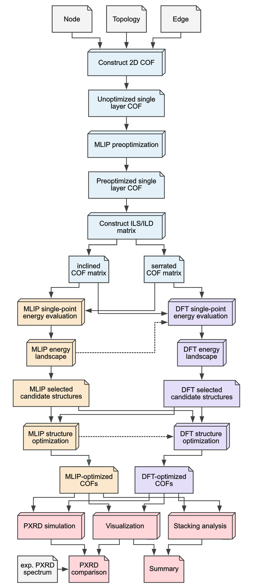

# COF-Landscaper

COF-Landscaper is a Python package for building and analyzing 2D COF stacking-energy landscapes.

Researchers interested in applying COF-Landscaper to their own systems are welcome to contact me at gjl342@student.bham.ac.uk, particularly if they are unable or prefer not to install and run the workflow themselves. Depending on availability and the scope of the project, I may be able to provide support or explore a possible collaboration.

## Platform Support

- Tested on macOS and Linux.
- Microsoft Windows is currently not tested.

## Install From Source (PyPI release planned)

Create a virtual environment with Python 3.12.

```bash
python3.12 -m venv test-coflandscaper
```

Activate the environment.

```bash
source test-coflandscaper/bin/activate
```

Confirm the active Python executable.

```bash
which python
```

Confirm the Python version is 3.12.

```bash
python --version
```

Upgrade pip.

```bash
pip install --upgrade pip
```

Confirm pip is available.

```bash
pip --version
```

Clone the repository.

```bash
git clone https://github.com/GregorLauter/COF-Landscaper.git
```

Enter the project directory.

```bash
cd COF-Landscaper
```

Install the package.

```bash
pip install .
```

Install the Jupyter kernel package.

```bash
pip install ipykernel
```

Register this environment as a Jupyter kernel.

```bash
python -m ipykernel install --user --name test-coflandscaper --display-name "Python (test-coflandscaper)"
```

## Workflow Notes

- The DFT workflow requires additional external HPC infrastructure.
- The MLIP workflow can be executed fully on a local machine.
- Workflow diagram:



## Example Notebook

- Example notebook location in this repository: `examples/COF-1/0_all/cof-landscaper.ipynb`
- After installation, you can work from any project folder on your computer.
- A practical workflow is to copy the example notebook into your own project directory and keep the original examples folder as a reference.

## Required Input Files

- The workflow requires separate node and linker fragments provided as `.xyz` files.
- Input fragments should ideally be pre-optimized with a generic force field, such as UFF, to remove severe steric clashes and obtain reasonable approximate bond lengths.
- The subsequent pre-optimization step handles the assembled framework. Therefore, the main requirement at this stage is that the individual fragments are chemically sensible and can be connected cleanly by the builder.
- The `.xyz` files can be prepared using any suitable molecular editor or visualizer, for example Avogadro, Mercury, or ChemDraw.

## VS Code Recommendation

VS Code is (personally) recommended for running and editing the notebook and Python code.

To use the correct kernel in VS Code:

1. Open the notebook.
2. Click the kernel selector in the top-right.
3. Choose `Python (test-coflandscaper)`.
4. Run a test cell such as `import coflandscaper as cl`.

## Where To Find Explanations

- A stepwise explanation of the computational workflow is provided in the Markdown cells of the example notebook.
- Methodological details, assumptions, and validation context are documented in the accompanying manuscript [insert link here].
